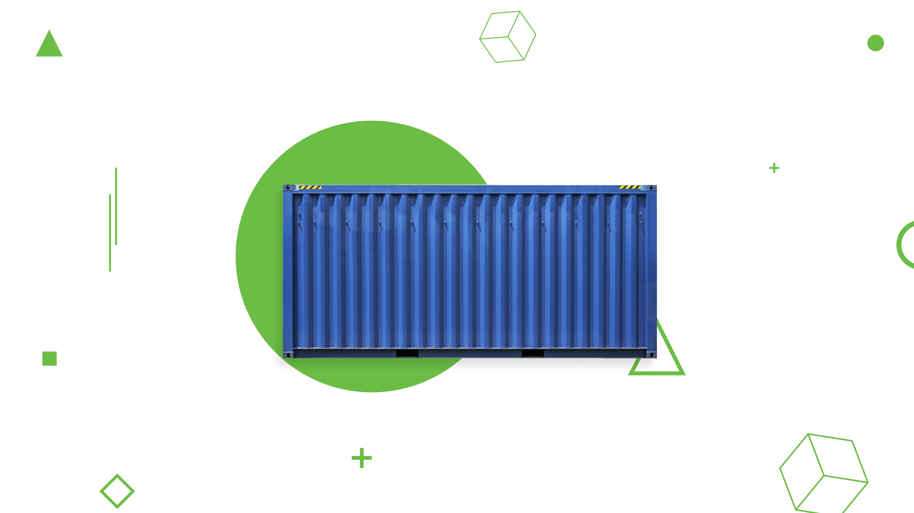
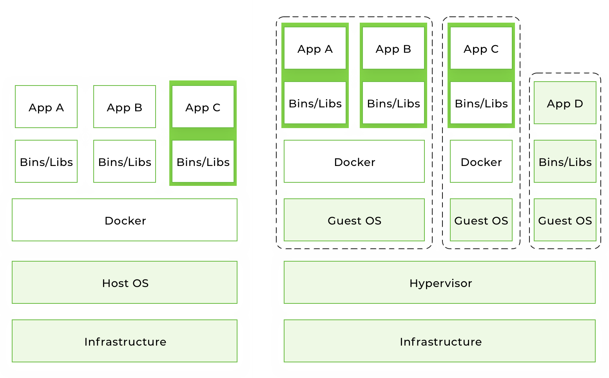
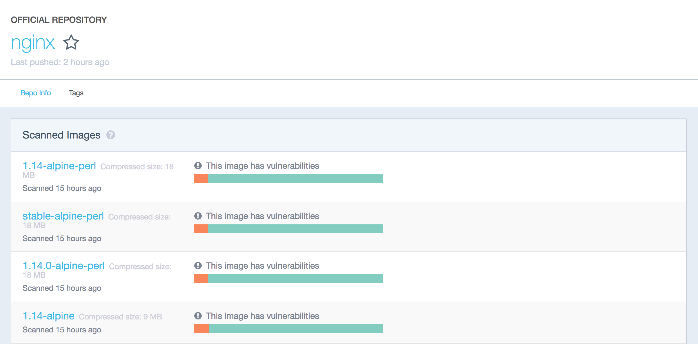

# What is Docker and How to Use it With Python (Tutorial)



This is an introductory tutorial on Docker containers. By the end of this article, you will know how to use Docker on your local machine. Along with Python, we are going to run Nginx and Redis containers. Those examples assume that you are familiar with the basic concepts of those technologies. There will be lots of shell examples, so go ahead and open the terminal.

## Table of contents

* [What is Docker?](#what-is-docker)
* [How does it differ from virtualization?](#how-does-it-differ-from-virtualization)
* [Why do we need Docker?](#why-do-we-need-docker)
* [Supported platforms](#supported-platforms)
* [Installation](#installation)
* [Terminology](#terminology)
* [Example 1: hello world](#example-1-hello-world)
* [Example 2: Environment variables and volumes](#example-2-environment-variables-and-volumes)
* [Example 3: Writing your first Dockerfile](#example-3-writing-your-first-dockerfile)
* [Best practices for creating images](#best-practices-for-creating-images)
* [Alpine images](#alpine-images)
* [Example 4: Connection between containers](#example-4-connection-between-containers)
* [Docker way](#docker-way)
* [Conclusion](#conclusion)

## What is Docker?

[Docker](https://www.docker.com/) is an open-source tool that automates the deployment of an application inside a software container. 
The easiest way to grasp the idea behind Docker is to compare it to, well... standard shipping containers.

Back in the day, transportation companies faced the following challenges:

* How to transport different (incompatible) types of goods side by side (like food and chemicals, or glass and bricks).
* How to handle packages of various sizes using the same vehicle.

After the introduction of containers, bricks could be put over glass, and chemicals could be stored next to food. Cargo of various sizes can be put inside a standardized container and loaded/unloaded by the same vehicle.

Let's go back to **containers in software development**.

When you develop an application, you need to provide your code along with all possible dependencies like libraries, the web server, databases, etc. You may end up in a situation when the application is working on your computer, but won't even start on the staging server, or the dev or QA's machine.

This challenge can be addressed by isolating the app to make it independent of the system.

## How does it differ from virtualization?

Traditionally, virtual machines were used to avoid this unexpected behavior. The main problem with VM is that an “extra OS” on top of the host operating system adds gigabytes of space to the project. Most of the time your server will host several VMs that will take up even more space. And by the way, at the moment, most cloud-based server providers will charge you for that extra space. Another significant drawback of VM is a slow boot.

Docker eliminates all the above by simply sharing the OS kernel across all the containers running as separate processes of the host OS.



Keep in mind that Docker is not the first and not the only containerization platform. However, at the moment Docker is the biggest and the most powerful player on the market.

## Why do we need Docker?

The short list of benefits includes:

* Faster development process
* Handy application encapsulation
* Same behaviour on local machine / dev / staging / production servers
* Easy and clear monitoring
* Easy to scale

### Faster development process

There is no need to install 3rd-party apps like PostgreSQL, Redis, Elasticsearch on the system -- you can run it in containers. Docker also gives you the ability to run different versions of same application simultaneously. For example, say you need to do some manual data migration from an older version of Postgres to a newer version. You can have such a situation in microservice architecture when you want to create a new microservice with a new version of the 3rd-party software.

It could be quite complex to keep two different versions of the same app on one host OS. In this case, Docker containers could be a perfect solution –- you receive isolated environments for your applications and 3rd-parties.

### Handy application encapsulation

You can deliver your application in one piece. Most programming languages, frameworks and all operating systems have their own packaging managers. And even if your application can be packed with its native package manager, it could be hard to create a port for another system.

Docker gives you a unified image format to distribute you applications across different host systems and cloud services. You can deliver your application in one piece with all the required dependencies (included in an image) ready to run.

### Same behaviour on local machine / dev / staging / production servers

Docker can't guarantee 100% dev / staging / production parity, because there is always the human factor. But it reduces to almost zero the probability of error caused by different versions of operating systems, system-dependencies, etc.

With right approach to building Docker images, your application will use the same base image with the same OS version and the required dependencies.

### Easy and clear monitoring

Out of the box, you have a unified way to read log files from all running containers. You don't need to remember all the specific paths where your app and its dependencies store log files and write custom hooks to handle this.

You can integrate an [external logging driver](https://docs.docker.com/config/containers/logging/configure/#supported-logging-drivers) and monitor your app log files in one place.

### Easy to scale

A correctly wrapped application will cover most of the [Twelve Factors](https://12factor.net/). By design, Docker forces you follow its core principles, such as configuration over environment variables, communication over TCP/UDP ports, etc. And if you've done your application right, it will be ready for scaling not only in Docker.

## Supported platforms

Docker's native platform is Linux, as it's based on features provided by the Linux kernel. However, you can still run it on macOS and Windows. The only difference is that on macOS and Windows, Docker is encapsulated into a tiny virtual machine. At the moment, Docker for macOS and Windows has reached a significant level of usability and feels more like a native app.

## Installation

You can check out the installation instructions for Docker [here](https://docs.docker.com/install/).

If you're running Docker on Linux, you need to run all the following commands as root or add your user to docker group and re-login:

```bash
sudo usermod -aG docker $(whoami)
```

## Terminology

* **Container** -- a running instance that encapsulates required software. Containers are always created from images. A container can expose ports and volumes to interact with other containers or/and the outer world. Containers can be easily killed / removed and re-created again in a very short time. Containers don't keep state.

* **Image** -- the basic element for every container. When you create an image, every step is cached and can be reused ([Copy On Write model](https://en.wikipedia.org/wiki/Copy-on-write)). Depending on the image, it can take some time to build. Containers, on the other hand, can be started from images right away.

* **Port** -- a TCP/UDP port in its original meaning. To keep things simple, let's assume that ports can be exposed to the outer world (accessible from the host OS) or connected to other containers –- i.e., accessible only from those containers and invisible to the outer world.

* **Volume** -- can be described as a shared folder. Volumes are initialized when a container is created. Volumes are designed to persist data, independent of the container's lifecycle.

* **Registry** – the server that stores Docker images. It can be compared to Github – you can pull an image from the registry to deploy it locally, and push locally built images to the registry.

* [**Docker hub**](https://hub.docker.com/explore/) -- a registry with web interface provided by Docker Inc. It stores a lot of Docker images with different software. Docker Hub is a source of the "official" Docker images made by the Docker team or in cooperation with the original software manufacturer (it doesn't necessary mean that these "original" images are from official software manufacturers). Official images list their potential vulnerabilities. This information is available to any logged-in user. There are both free and paid accounts available. You can have one private image per account and an infinite amount of public images for free. [**Docker Store**](https://store.docker.com/search?type=image&source=verified) -- a service very similar to Docker Hub. It's a marketplace with ratings, reviews, etc. My personal opinion is that it's marketing stuff. I'm totally happy with Docker Hub.



## Example 1: hello world

It's time to run your first container:

```bash
docker run ubuntu /bin/echo 'Hello world'
```

Console output:

```
Unable to find image 'ubuntu:latest' locally
latest: Pulling from library/ubuntu
6b98dfc16071: Pull complete
4001a1209541: Pull complete
6319fc68c576: Pull complete
b24603670dc3: Pull complete
97f170c87c6f: Pull complete
Digest: sha256:5f4bdc3467537cbbe563e80db2c3ec95d548a9145d64453b06939c4592d67b6d
Status: Downloaded newer image for ubuntu:latest
Hello world
```

* **docker run** is a command to run a container.
* **ubuntu** is the image you run. For example, the Ubuntu operating system image. When you specify an image, Docker looks first for the image on your Docker host. If the image does not exist locally, then the image is pulled from the public image registry -- Docker Hub.
* **/bin/echo 'Hello world'** is the command that will run inside a new container. This container simply prints “Hello world” and stops the execution.

Let's try to create an interactive shell inside a Docker container:

```bash
docker run -i -t --rm ubuntu /bin/bash
```

* **-t** flag assigns a pseudo-tty or terminal inside the new container.
* **-i** flag allows you to make an interactive connection by grabbing the standard input (STDIN) of the container.
* **--rm** flag automatically removes the container when the process exits. By default, containers are not deleted. This container exists until we keep the shell session and terminates when we exit the session (like an SSH session with a remote server).

If you want to keep the container running after the end of the session, you need to daemonize it:

```bash
docker run --name daemon -d ubuntu /bin/sh -c "while true; do echo hello world; sleep 1; done"
```

* **--name daemon** assigns daemon name to a new container. If you don't specify a name explicitly, Docker will generate and assign it automatically.
* **-d** flag runs the container in the background (i.e., daemonizes it).

Let's see what containers we have at the moment:

```bash
docker ps -a
```

Console output:

```
CONTAINER ID  IMAGE   COMMAND                 CREATED             STATUS                         PORTS  NAMES
1fc8cee64ec2  ubuntu  "/bin/sh -c 'while..."  32 seconds ago      Up 30 seconds                         daemon
c006f1a02edf  ubuntu  "/bin/echo 'Hello ..."  About a minute ago  Exited (0) About a minute ago         gifted_nobel
```

* **docker ps** is a command to list containers.
* **-a** shows all containers (without -a flag ps will show only running containers).

The **ps** shows us that we have two containers:

* **gifted_nobel** (the name for this container was generated automatically – it will be different on your machine). It's the first container we created, the one that printed 'Hello world' once.
* **daemon** -- the third container we created, which runs as a daemon.

Note: there is no second container (the one with interactive shell) because we set the **--rm option**. As a result, this container is automatically deleted right after execution.

Let's check the logs and see what the daemon container is doing right now:

```bash
docker logs -f daemon
```

Console output:

```
...
hello world
hello world
hello world
```

* **docker logs** fetch the logs of a container.
* **-f** flag to follow the log output (works actually like **tail -f**).

Now let's stop the daemon container:

```bash
docker stop daemon
```

Make sure the container has stopped.

```bash
docker ps -a
```

Console output:

```
CONTAINER ID  IMAGE   COMMAND                 CREATED        STATUS                      PORTS  NAMES
1fc8cee64ec2  ubuntu  "/bin/sh -c 'while..."  5 minutes ago  Exited (137) 5 seconds ago         daemon
c006f1a02edf  ubuntu  "/bin/echo 'Hello ..."  6 minutes ago  Exited (0) 6 minutes ago           gifted_nobel
```

The container is stopped. We can start it again:

```bash
docker start daemon
```

Let's ensure that it's running:

```bash
docker ps -a 
```

Console output:

```
CONTAINER ID  IMAGE   COMMAND                 CREATED        STATUS                    PORTS  NAMES
1fc8cee64ec2  ubuntu  "/bin/sh -c 'while..."  5 minutes ago  Up 3 seconds                     daemon
c006f1a02edf  ubuntu  "/bin/echo 'Hello ..."  6 minutes ago  Exited (0) 7 minutes ago         gifted_nobel
```

Now, stop it again and remove all the containers manually:

```
docker stop daemon
docker rm <your first container name>
docker rm daemon
```

To remove all containers, we can use the following command:

```bash
docker rm -f $(docker ps -aq)
```

* **docker rm** is the command to remove the container.
* **-f** flag (for rm) stops the container if it's running (i.e., force deletion).
* **-q** flag (for ps) is to print only container IDs.

## Example 2: Environment variables and volumes

Starting from this example, you'll need several additional files you can find on my [GitHub repo](https://github.com/alexryabtsev/docker-workshop/). 
You can clone my repo or simply use the [following link](https://github.com/alexryabtsev/docker-workshop/archive/master.zip) to download the sample files.

It's time to create and run more a meaningful container, like **Nginx**.

Change the directory to **examples/nginx**:

```bash
docker run -d --name "test-nginx" -p 8080:80 -v $(pwd):/usr/share/nginx/html:ro nginx:latest
```

**Warning:** This command looks quite heavy, but it's just an example to explain volumes and env variables. In 99% of real-life cases, you won't start Docker containers manually –- you'll use orchestration services (we'll cover [docker-compose](https://docs.docker.com/compose/overview/) in [example #4](#example-4-connection-between-containers)) or write a custom script to do it.

Console output:

```
Unable to find image 'nginx:latest' locally
latest: Pulling from library/nginx
683abbb4ea60: Pull complete
a470862432e2: Pull complete
977375e58a31: Pull complete
Digest: sha256:a65beb8c90a08b22a9ff6a219c2f363e16c477b6d610da28fe9cba37c2c3a2ac
Status: Downloaded newer image for nginx:latest
afa095a8b81960241ee92ecb9aa689f78d201cff2469895674cec2c2acdcc61c
```

* **-p** is a ports mapping **HOST PORT:CONTAINER PORT**.
* **-v** is a volume mounting **HOST DIRECTORY:CONTAINER DIRECTORY**.

**Important:** run command accepts only absolute paths. In our example, we've used **$(pwd)** to set the current directory absolute path.

Now check this [url](http://127.0.0.1:8080/) in your web browser.

We can try to change **/example/nginx/index.html** (which is mounted as a volume to **/usr/share/nginx/html** directory inside the container) and refresh the page.

Let's get the information about **test-nginx** container:

```bash
docker inspect test-nginx
```

This command displays system-wide information about the Docker installation. This information includes the kernel version, number of containers and images, exposed ports, mounted volumes, etc.

## Example 3: Writing your first Dockerfile

To build a Docker image, you need to create a Dockerfile. It is a plain text file with instructions and arguments. Here is the description of the instructions we're going to use in our next example:

* **FROM** -- set base image
* **RUN** -- execute command in container
* **ENV** -- set environment variable
* **WORKDIR** -- set working directory
* **VOLUME** -- create mount-point for a volume
* **CMD** -- set executable for container

You can check [Dockerfile reference](https://docs.docker.com/engine/reference/builder/) for more details.

Let's create an image that will get the contents of the website with **curl** and store it to the text file. We need to pass website url via environment variable **SITE_URL**. Resulting file will be placed in a directory mounted as a volume.

Place a file name **Dockerfile** in **examples/curl** directory with the following contents:

```dockerfile
FROM ubuntu:latest
RUN apt-get update \
    && apt-get install --no-install-recommends --no-install-suggests -y curl \
    && rm -rf /var/lib/apt/lists/*
ENV SITE_URL http://example.com/
WORKDIR /data
VOLUME /data
CMD sh -c "curl -Lk $SITE_URL > /data/results"
```

Dockerfile is ready. It's time to build the actual image.

Go to **examples/curl** directory and execute the following command to build an image:

```bash
docker build . -t test-curl
```

Console output:

```
Sending build context to Docker daemon  3.584kB
Step 1/6 : FROM ubuntu:latest
 ---> 113a43faa138
Step 2/6 : RUN apt-get update     && apt-get install --no-install-recommends --no-install-suggests -y curl     && rm -rf /var/lib/apt/lists/*
 ---> Running in ccc047efe3c7
Get:1 http://archive.ubuntu.com/ubuntu bionic InRelease [242 kB]
Get:2 http://security.ubuntu.com/ubuntu bionic-security InRelease [83.2 kB]
...
Removing intermediate container ccc047efe3c7
 ---> 8d10d8dd4e2d
Step 3/6 : ENV SITE_URL http://example.com/
 ---> Running in 7688364ef33f
Removing intermediate container 7688364ef33f
 ---> c71f04bdf39d
Step 4/6 : WORKDIR /data
Removing intermediate container 96b1b6817779
 ---> 1ee38cca19a5
Step 5/6 : VOLUME /data
 ---> Running in ce2c3f68dbbb
Removing intermediate container ce2c3f68dbbb
 ---> f499e78756be
Step 6/6 : CMD sh -c "curl -Lk $SITE_URL > /data/results"
 ---> Running in 834589c1ac03
Removing intermediate container 834589c1ac03
 ---> 4b79e12b5c1d
Successfully built 4b79e12b5c1d
Successfully tagged test-curl:latest
```

* **docker build** command builds a new image locally.
* **-t** flag sets the name tag to an image.

Now we have the new image, and we can see it in the list of existing images:

```bash
docker images
```

Console output:

```
REPOSITORY  TAG     IMAGE ID      CREATED         SIZE
test-curl   latest  5ebb2a65d771  37 minutes ago  180 MB
nginx       latest  6b914bbcb89e  7 days ago      182 MB
ubuntu      latest  0ef2e08ed3fa  8 days ago      130 MB
```

We can create and run the container from the image. Let's try it with the default parameters:

```bash
docker run --rm -v $(pwd)/vol:/data/:rw test-curl
```

To see results saved to file run:

```bash
cat ./vol/results
```

Let's try with **facebook.com**:

```bash
docker run --rm -e SITE_URL=https://facebook.com/ -v $(pwd)/vol:/data/:rw test-curl
```

To see the results saved to file run:

```bash
cat ./vol/results
```

## Best practices for creating images

* Include only **necessary context** -- use a [**.dockerignore**](https://docs.docker.com/engine/reference/builder/#dockerignore-file) file (like .gitignore in git)
* Avoid installing **unnecessary packages** -- it will consume extra disk space.
* **Use cache**. Add context which changes a lot (for example, the source code of your project) at the end of Dockerfile -- it will utilize Docker cache effectively.
* **Be careful with volumes**. You should remember what data is in volumes. Because volumes are persistent and don't die with the containers, the next container will use data from the volume created by the previous container.
* Use [**environment variables**](https://docs.docker.com/engine/reference/builder/#environment-replacement) (in RUN, EXPOSE, VOLUME). It will make your Dockerfile more flexible.

## Alpine images

A lot of Docker images (versions of images) are created on top of [**Alpine Linux**](https://alpinelinux.org/) -- this is a lightweight distro that allows you to reduce the overall size of Docker images.

I recommend that you use images based on Alpine for third-party services, such as Redis, Postgres, etc. For your app images, use images based on [**buildpack**](https://hub.docker.com/_/buildpack-deps/) -- it will be easy to debug inside the container, and you'll have a lot of pre-installed system-wide requirements.

Only you can decide which base image to use, but you can get the maximum benefit by using one basic image for all images, because in this case the cache will be used more effectively.

## Example 4: Connection between containers

[**Docker compose**](https://docs.docker.com/compose/overview/) -- is an CLI utility used to connect containers with each other.

You can install docker-compose [via pip](https://pypi.org/project/docker-compose/):

```bash
sudo pip install docker-compose
```

In this example, I am going to connect Python and Redis containers.

```yaml
version: '3.6'
services:
  app:
    build:
      context: ./app
    depends_on:
      - redis
    environment:
      - REDIS_HOST=redis
    ports:
      - "5000:5000"
  redis:
    image: redis:3.2-alpine
    volumes:
      - redis_data:/data
volumes:
  redis_data:
```

Go to **examples/compose** and execute the following command:

```bash
docker-compose up
```

Console output:

```
Building app
Step 1/9 : FROM python:3.6.3
3.6.3: Pulling from library/python
f49cf87b52c1: Pull complete
7b491c575b06: Pull complete
b313b08bab3b: Pull complete
51d6678c3f0e: Pull complete
09f35bd58db2: Pull complete
1bda3d37eead: Pull complete
9f47966d4de2: Pull complete
9fd775bfe531: Pull complete
Digest: sha256:cdef88d8625cf50ca705b7abfe99e8eb33b889652a9389b017eb46a6d2f1aaf3
Status: Downloaded newer image for python:3.6.3
 ---> a8f7167de312
Step 2/9 : ENV BIND_PORT 5000
 ---> Running in 3b6fe5ca226d
Removing intermediate container 3b6fe5ca226d
 ---> 0b84340fa920
Step 3/9 : ENV REDIS_HOST localhost
 ---> Running in a4f9a1d6f541
Removing intermediate container a4f9a1d6f541
 ---> ebe63bf5959e
Step 4/9 : ENV REDIS_PORT 6379
 ---> Running in fd06aa65fd33
Removing intermediate container fd06aa65fd33
 ---> 2a581c31ff4f
Step 5/9 : COPY ./requirements.txt /requirements.txt
 ---> 671093a12829
Step 6/9 : RUN pip install -r /requirements.txt
 ---> Running in b8ea53bc6ba6
Collecting flask==1.0.2 (from -r /requirements.txt (line 1))
  Downloading https://files.pythonhosted.org/packages/7f/e7/08578774ed4536d3242b14dacb4696386634607af824ea997202cd0edb4b/Flask-1.0.2-py2.py3-none-any.whl (91kB)
Collecting redis==2.10.6 (from -r /requirements.txt (line 2))
  Downloading https://files.pythonhosted.org/packages/3b/f6/7a76333cf0b9251ecf49efff635015171843d9b977e4ffcf59f9c4428052/redis-2.10.6-py2.py3-none-any.whl (64kB)
Collecting click>=5.1 (from flask==1.0.2->-r /requirements.txt (line 1))
  Downloading https://files.pythonhosted.org/packages/34/c1/8806f99713ddb993c5366c362b2f908f18269f8d792aff1abfd700775a77/click-6.7-py2.py3-none-any.whl (71kB)
Collecting Jinja2>=2.10 (from flask==1.0.2->-r /requirements.txt (line 1))
  Downloading https://files.pythonhosted.org/packages/7f/ff/ae64bacdfc95f27a016a7bed8e8686763ba4d277a78ca76f32659220a731/Jinja2-2.10-py2.py3-none-any.whl (126kB)
Collecting itsdangerous>=0.24 (from flask==1.0.2->-r /requirements.txt (line 1))
  Downloading https://files.pythonhosted.org/packages/dc/b4/a60bcdba945c00f6d608d8975131ab3f25b22f2bcfe1dab221165194b2d4/itsdangerous-0.24.tar.gz (46kB)
Collecting Werkzeug>=0.14 (from flask==1.0.2->-r /requirements.txt (line 1))
  Downloading https://files.pythonhosted.org/packages/20/c4/12e3e56473e52375aa29c4764e70d1b8f3efa6682bef8d0aae04fe335243/Werkzeug-0.14.1-py2.py3-none-any.whl (322kB)
Collecting MarkupSafe>=0.23 (from Jinja2>=2.10->flask==1.0.2->-r /requirements.txt (line 1))
  Downloading https://files.pythonhosted.org/packages/4d/de/32d741db316d8fdb7680822dd37001ef7a448255de9699ab4bfcbdf4172b/MarkupSafe-1.0.tar.gz
Building wheels for collected packages: itsdangerous, MarkupSafe
  Running setup.py bdist_wheel for itsdangerous: started
  Running setup.py bdist_wheel for itsdangerous: finished with status 'done'
  Stored in directory: /root/.cache/pip/wheels/2c/4a/61/5599631c1554768c6290b08c02c72d7317910374ca602ff1e5
  Running setup.py bdist_wheel for MarkupSafe: started
  Running setup.py bdist_wheel for MarkupSafe: finished with status 'done'
  Stored in directory: /root/.cache/pip/wheels/33/56/20/ebe49a5c612fffe1c5a632146b16596f9e64676768661e4e46
Successfully built itsdangerous MarkupSafe
Installing collected packages: click, MarkupSafe, Jinja2, itsdangerous, Werkzeug, flask, redis
Successfully installed Jinja2-2.10 MarkupSafe-1.0 Werkzeug-0.14.1 click-6.7 flask-1.0.2 itsdangerous-0.24 redis-2.10.6
You are using pip version 9.0.1, however version 10.0.1 is available.
You should consider upgrading via the 'pip install --upgrade pip' command.
Removing intermediate container b8ea53bc6ba6
 ---> 3117d3927951
Step 7/9 : COPY ./app.py /app.py
 ---> 84a82fa91773
Step 8/9 : EXPOSE $BIND_PORT
 ---> Running in 8e259617b7b5
Removing intermediate container 8e259617b7b5
 ---> 55f447f498dd
Step 9/9 : CMD [ "python", "/app.py" ]
 ---> Running in 2ade293ecb25
Removing intermediate container 2ade293ecb25
 ---> b85b4246e9f8

Successfully built b85b4246e9f8
Successfully tagged compose_app:latest
WARNING: Image for service app was built because it did not already exist. To rebuild this image you must use `docker-compose build` or `docker-compose up --build`.
Creating compose_redis_1 ... done
Creating compose_app_1   ... done
Attaching to compose_redis_1, compose_app_1
redis_1  | 1:C 08 Jul 18:12:21.851 # Warning: no config file specified, using the default config. In order to specify a config file use redis-server /path/to/redis.conf
redis_1  |                 _._
redis_1  |            _.-``__ ''-._
redis_1  |       _.-``    `.  `_.  ''-._           Redis 3.2.12 (00000000/0) 64 bit
redis_1  |   .-`` .-```.  ```\/    _.,_ ''-._
redis_1  |  (    '      ,       .-`  | `,    )     Running in standalone mode
redis_1  |  |`-._`-...-` __...-.``-._|'` _.-'|     Port: 6379
redis_1  |  |    `-._   `._    /     _.-'    |     PID: 1
redis_1  |   `-._    `-._  `-./  _.-'    _.-'
redis_1  |  |`-._`-._    `-.__.-'    _.-'_.-'|
redis_1  |  |    `-._`-._        _.-'_.-'    |           http://redis.io
redis_1  |   `-._    `-._`-.__.-'_.-'    _.-'
redis_1  |  |`-._`-._    `-.__.-'    _.-'_.-'|
redis_1  |  |    `-._`-._        _.-'_.-'    |
redis_1  |   `-._    `-._`-.__.-'_.-'    _.-'
redis_1  |       `-._    `-.__.-'    _.-'
redis_1  |           `-._        _.-'
redis_1  |               `-.__.-'
redis_1  |
redis_1  | 1:M 08 Jul 18:12:21.852 # WARNING: The TCP backlog setting of 511 cannot be enforced because /proc/sys/net/core/somaxconn is set to the lower value of 128.
redis_1  | 1:M 08 Jul 18:12:21.852 # Server started, Redis version 3.2.12
redis_1  | 1:M 08 Jul 18:12:21.852 # WARNING overcommit_memory is set to 0! Background save may fail under low memory condition. To fix this issue add 'vm.overcommit_memory = 1' to /etc/sysctl.conf and then reboot or run the command 'sysctl vm.overcommit_memory=1' for this to take effect.
redis_1  | 1:M 08 Jul 18:12:21.852 # WARNING you have Transparent Huge Pages (THP) support enabled in your kernel. This will create latency and memory usage issues with Redis. To fix this issue run the command 'echo never > /sys/kernel/mm/transparent_hugepage/enabled' as root, and add it to your /etc/rc.local in order to retain the setting after a reboot. Redis must be restarted after THP is disabled.
redis_1  | 1:M 08 Jul 18:12:21.852 * The server is now ready to accept connections on port 6379
app_1    |  * Serving Flask app "app" (lazy loading)
app_1    |  * Environment: production
app_1    |    WARNING: Do not use the development server in a production environment.
app_1    |    Use a production WSGI server instead.
app_1    |  * Debug mode: on
app_1    |  * Running on http://0.0.0.0:5000/ (Press CTRL+C to quit)
app_1    |  * Restarting with stat
app_1    |  * Debugger is active!
app_1    |  * Debugger PIN: 170-528-240
```

The current example will increment view counter in Redis. Open the [following url](http://127.0.0.1:5000/) in your web browser and check it.

How to use docker-compose is a topic for a separate tutorial. To get started, you can play with some images from Docker Hub. If you want to create your own images, follow the best practices listed above. The only thing I can add in terms of using docker-compose is that you should **always give explicit names to your volumes** in docker-compose.yml ((if the image has volumes). This simple rule will save you from an issue in the future when you'll be inspecting your volumes.

```yaml
version: '3.6'
services:
  ...
  redis:
    image: redis:3.2-alpine
    volumes:
      - redis_data:/data
volumes:
  redis_data:
```

In this case **redis_data** will be the name inside the docker-compose.yml file; for the real volume name, it will be prepended with project name prefix.

To see volumes run:

```bash
docker volume ls
```

Console output:

```
DRIVER              VOLUME NAME
local               apptest_redis_data
```

Without an explicit volume name, there will be UUID. Here's an example from my local machine:

```
DRIVER              VOLUME NAME
local               ec1a5ac0a2106963c2129151b27cb032ea5bb7c4bd6fe94d9dd22d3e72b2a41b
local               f3a664ce353ba24dd43d8f104871594de6024ed847054422bbdd362c5033fc4c
local               f81a397776458e62022610f38a1bfe50dd388628e2badc3d3a2553bb08a5467f
local               f84228acbf9c5c06da7be2197db37f2e3da34b7e8277942b10900f77f78c9e64
local               f9958475a011982b4dc8d8d8209899474ea4ec2c27f68d1a430c94bcc1eb0227
local               ff14e0e20d70aa57e62db0b813db08577703ff1405b2a90ec88f48eb4cdc7c19
local               polls_pg_data
local               polls_public_files
local               polls_redis_data
local               projectdev_pg_data
local               projectdev_redis_data
```

## Docker way

Docker has some restrictions and requirements, depending on the architecture of your system (applications that you pack into containers). You can ignore these requirements or find some workarounds, but in this case, you won't get all the benefits of using Docker. My strong advice is to follow these recommendations:

* **1 application = 1 container**.
* Run process in the **foreground** (don't use systemd, upstart or any other similar tools).
* **Keep data out of container** -- use volumes.
* **Do not use SSH** (if you need to step into container you can use docker exec command).
* **Avoid manual configurations** (or actions) inside container.

## Conclusion

To summarize this tutorial, alongside with IDE and Git, Docker has become a must-have developer tool. It's a production-ready tool with a rich and mature infrastructure.

Docker can be used on all types of projects, regardless of size and complexity. In the beginning, you can start with [compose](https://docs.docker.com/compose/overview/) and [Swarm](https://docs.docker.com/engine/swarm/). When the project grows, you can migrate to cloud services like [Amazon Container Services](https://aws.amazon.com/containers/) or [Kubernetes](https://kubernetes.io/).

Like standard containers used in cargo transportation, wrapping your code in Docker containers will help you build faster and more efficient CI/CD processes. This is not just another technological trend promoted by a bunch of geeks –- it's a new paradigm that is already being used in the architecture of large companies like [PayPal](https://blog.docker.com/2017/12/containers-at-paypal/), [Visa](https://blog.docker.com/2017/04/visa-inc-gains-speed-operational-efficiency-docker-enterprise-edition/), [Swisscom](https://www.docker.com/customers/swisscom-goes-400vms-20vms-docker), [General Electric](https://www.docker.com/customers/ge-uses-docker-enable-self-service-their-developers), [Splink](https://www.docker.com/customers/docker-datacenter-delivers-splunks-house-demos), etc.
